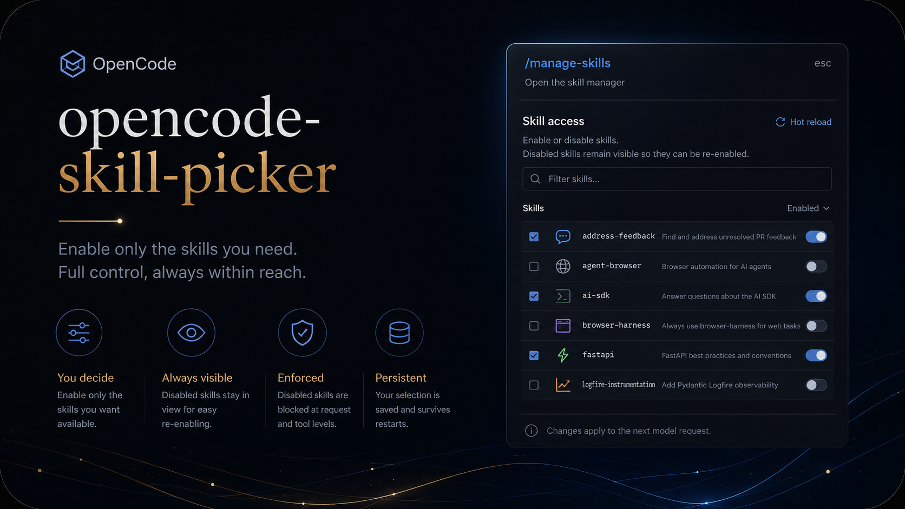

<p align="center">
  
</p>

# opencode-skill-picker

Choose exactly which OpenCode skills a session can use—without losing the
ability to see or restore anything you turned off. The plugin preserves
OpenCode's native skills experience and adds `/manage-skills`, a keyboard-first
picker with durable, enforced selection state.

[](https://github.com/ReyJ94/Opencode-Skill-Picker)
[](https://github.com/ReyJ94/Opencode-Skill-Picker/releases/tag/v0.1.0)

> **The short version:** select the skills you want in context; disabled skills
> remain visible, recoverable, and blocked from model use.

## Highlights

- **Selective skill access** — enable or disable individual skills per persisted selection state.
- **Recoverable choices** — disabled skills remain visible in the management dialog for one-step restoration.
- **Native integration** — preserves the normal skills list and uses OpenCode's existing command interface.
- **Enforced availability** — removes disabled skills from model context and denies direct skill-tool calls.
- **Durable local state** — atomically stores the selection with owner-only permissions where supported.

## Install

Install directly from GitHub:

```bash
opencode plugin github:ReyJ94/Opencode-Skill-Picker
```

For local development, generate and install a tarball:

```bash
npm pack
opencode plugin ./opencode-skill-picker-0.1.0.tgz
```

## Manual configuration

The plugin has server and TUI entrypoints. If configuring it manually, add both
exports to their corresponding OpenCode config targets:

`opencode.json`:

```json
{ "plugin": ["opencode-skill-picker/server"] }
```

`tui.json`:

```json
{ "plugin": ["opencode-skill-picker/tui"] }
```

## Configuration and state

Set the same option on both plugin entries when you use a custom path:

```json
{
  "plugin": [["opencode-skill-picker/server", { "selectionPath": "/path/to/selection.json" }]]
}
```

Use the corresponding `/tui` entry in `tui.json` when configuring both targets.

The selected state path is resolved in this order:

1. Plugin `selectionPath` option.
2. `OPENCODE_SKILL_SELECTION_PATH`.
3. `$XDG_DATA_HOME/opencode-skill-picker/selection.json`.
4. `~/.local/share/opencode-skill-picker/selection.json`.

The file is created as needed and atomically written with owner-only permissions
where the filesystem supports them. Missing, malformed, or unsupported state is
treated as no disabled skills. Its versioned format is:

```json
{
  "version": 1,
  "disabled": ["skill-name"]
}
```

## Usage

1. Run `/manage-skills`.
2. Select a skill and press Space, or select it, to toggle access.
3. Start the next model request with the updated skill set.

Disabled skills are removed from `<available_skills>` before a model request,
denied if a model still calls the `skill` tool, and removed from the native
skills list. The management dialog always retains them so they can be re-enabled.

## Development

```bash
npm test
npm run check
npm run pack:dry-run
```

Repository: <https://github.com/ReyJ94/Opencode-Skill-Picker>
